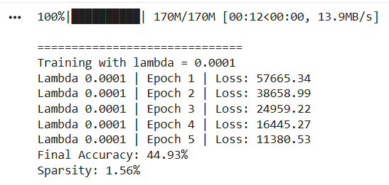
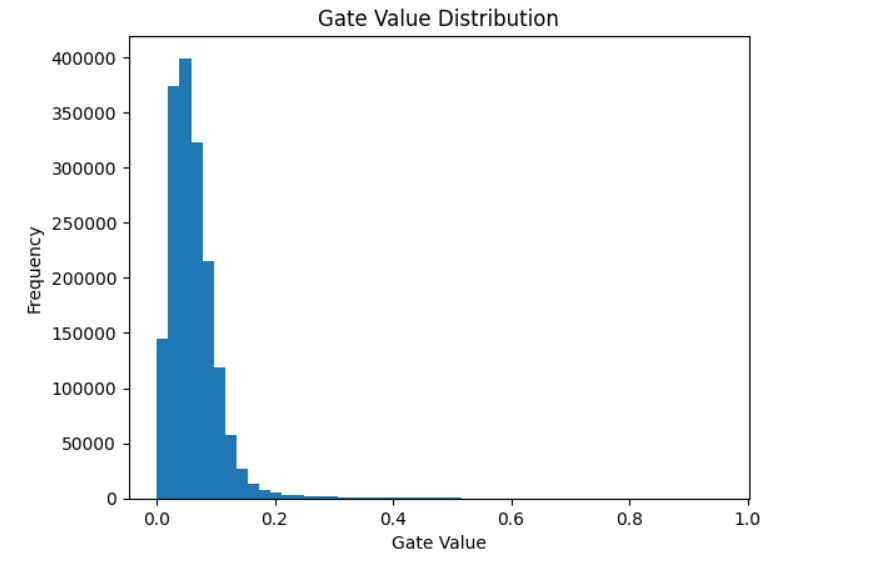
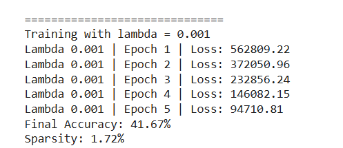
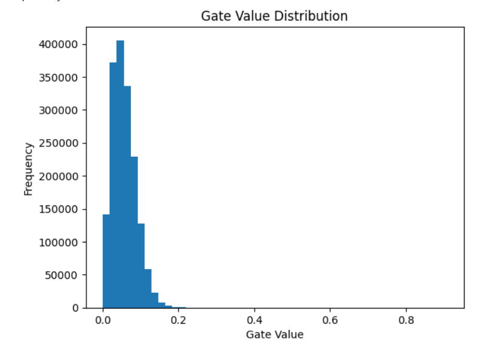
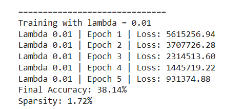
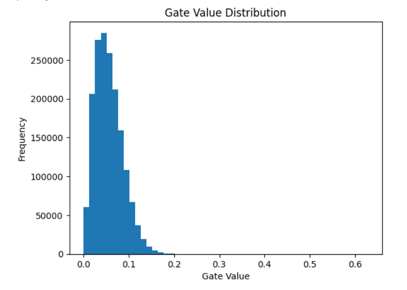

# Self-Pruning Neural Network (CIFAR-10)

## Overview

This project implements a self-pruning neural network where weights are dynamically removed during training using learnable gates and sparsity regularization.

---

## Core Idea

Each weight is controlled by a gate:

* Gate ≈ 1 → active weight
* Gate ≈ 0 → pruned weight

This is implemented as:

Effective Weight = Weight × Sigmoid(Gate Score)

---

## Loss Function

Total Loss = CrossEntropyLoss + λ × L1(Gates)

* CrossEntropy → classification performance
* L1(Gates) → encourages sparsity
* λ → controls pruning strength

---

## Results

| Lambda | Accuracy | Sparsity |
| ------ | -------- | -------- |
| 0.0001 | 44.93%   | 1.56%    |
| 0.001  | 41.67%   | 1.72%    |
| 0.01   | 38.14%   | 1.72%    |

---

## Observations

* Accuracy decreases as λ increases, which is expected due to stronger regularization
* Sparsity remains low (~1.5–1.7%), indicating weak pruning effect
* The model learns, but does not aggressively remove weights

---

## Key Insight

Although L1 regularization is applied to gate values, it is not strong enough to push most gates toward zero.

This suggests:

* λ values are relatively small compared to the loss scale
* Training duration is insufficient for strong sparsity
* More aggressive pruning strategies are required

---

## Results Visualization

### Lambda = 0.0001

Training Output


Gate Distribution


---

### Lambda = 0.001

Training Output


Gate Distribution


---

### Lambda = 0.01

Training Output


Gate Distribution


---

## How to Run

```bash
python self_pruning_nn.py
```

---

## Tech Stack

* Python
* PyTorch
* CIFAR-10
* Matplotlib

---

## Future Improvements

* Increase λ (e.g., 0.05, 0.1)
* Train for more epochs (10–20)
* Normalize input data
* Apply structured pruning (neuron-level)
* Use stronger sparsity-inducing methods (e.g., Hard Concrete gates)

---

## Conclusion

The implementation demonstrates the concept of self-pruning during training. While the pruning effect is limited, the approach is functionally correct and highlights the importance of tuning regularization strength to achieve meaningful sparsity.
